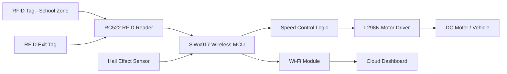
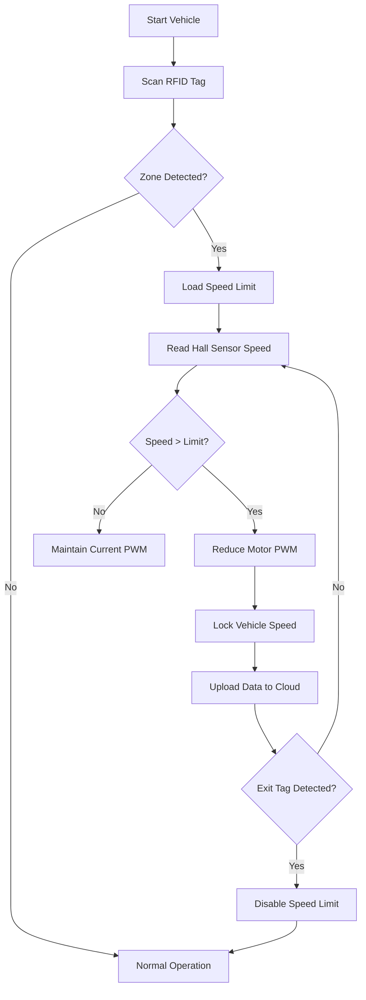

# Automatic Vehicle Speed Limiter for School and Hospital Zones

## 1. Project Overview

### Description

The Smart Zone-Based Vehicle Speed Limiter is an intelligent transportation safety system designed to automatically regulate vehicle speed in restricted areas such as schools, hospitals, residential zones, industrial campuses, and pedestrian-sensitive regions.

The system utilizes RFID-based zone identification and a Silicon Labs SiWx917 wireless MCU platform to enforce speed limits without relying solely on driver compliance. RFID tags placed at the entry and exit points of a restricted area communicate zone information to the vehicle through an RC522 RFID reader. The SiWx917 controller processes the received zone information, continuously monitors vehicle speed using a Hall-effect sensor, and dynamically limits motor power whenever the vehicle exceeds the predefined speed limit.

Additionally, the built-in Wi-Fi capability of the SiWx917 enables real-time cloud connectivity, allowing speed data, zone status, and operational analytics to be uploaded to a remote dashboard for monitoring and management.

### Target Users

* Schools and Educational Campuses
* Hospitals and Healthcare Facilities
* Residential Communities
* Industrial Parks
* Smart City Transportation Systems
* Municipal Traffic Authorities

### Motivation

Overspeeding in sensitive areas continues to be a major contributor to road accidents. Existing solutions such as speed signs and speed breakers rely heavily on driver awareness and compliance. This project demonstrates how embedded systems, RFID-based localization, and wireless connectivity can be combined to actively enforce speed limits and improve public safety.

---

# 2. Technical Architecture

## System Architecture

---

## Operational Flowchart

---

# 3. Technologies Used

## Wireless Technologies

* Wi-Fi 6
* RFID-Based Zone Identification

## Silicon Labs Technologies

* Silicon Labs SiWx917 Wireless MCU
* Gecko SDK (GSDK)
* Simplicity Studio

## Programming Languages

* C
* Embedded C++
* Python (Dashboard and Analytics)

## Development Tools

* Simplicity Studio
* Visual Studio Code
* GitHub
* Draw.io
* Mermaid Diagrams

## Communication Interfaces

* SPI (RC522 RFID Reader)
* GPIO
* PWM
* UART Debug Interface

---

# 4. Hardware Components

## Silicon Labs Hardware

| Component               | Description              |
| ----------------------- | ------------------------ |
| SiWx917 Development Kit | Main Embedded Controller |
| Integrated Wi-Fi Module | Cloud Connectivity       |
| Onboard Debug Interface | Firmware Development     |

---

## Sensors and Expansion Modules

| Component                  | Purpose                       |
| -------------------------- | ----------------------------- |
| RC522 RFID Reader          | Zone Identification           |
| RFID Tags                  | Zone Entry and Exit Detection |
| Hall Effect Sensor (A3144) | Speed Measurement             |
| Buzzer Module              | Alert Notifications           |

---

## External Hardware

| Component           | Purpose                          |
| ------------------- | -------------------------------- |
| L298N Motor Driver  | Motor Speed Control              |
| DC Motor            | Vehicle Propulsion               |
| Toy Vehicle Chassis | Prototype Demonstration Platform |
| USB Power Supply    | System Power Source              |
| Breadboard          | Prototyping                      |
| Jumper Wires        | Electrical Connections           |

---

# 5. Software Components / Dependencies

## Silicon Labs Dependencies

| Dependency           | Version                   |
| -------------------- | ------------------------- |
| Gecko SDK (GSDK)     | Latest Stable Release     |
| Simplicity Studio    | Version 5.x               |
| Wi-Fi SDK Components | Included with SiWx917 SDK |

---

## External Dependencies

| Software               | Purpose               |
| ---------------------- | --------------------- |
| Git                    | Version Control       |
| GitHub                 | Repository Hosting    |
| Python                 | Dashboard Backend     |
| MQTT Client (Optional) | Cloud Communication   |
| Draw.io                | Architecture Diagrams |

---

# 6. Features

* Automatic Zone Detection
* RFID-Based Speed Limit Activation
* Dynamic Speed Limiting
* Real-Time Speed Monitoring
* PWM Motor Control
* Wi-Fi Cloud Connectivity
* Speed Analytics Dashboard
* Configurable Zone Profiles
* Exit Zone Detection and Recovery
* Audible Warning Notifications

---

# 7. Future Enhancements

### GPS Geofencing

Replace RFID infrastructure with GPS-based virtual zones.

### Vehicle-to-Infrastructure Communication

Implement direct communication between road infrastructure and vehicles.

### AI-Based Traffic Analytics

Analyze driver behavior and traffic trends.

### Emergency Vehicle Override

Allow authorized emergency vehicles to bypass restrictions.

### Smart City Integration

Connect with city-wide transportation monitoring systems.

### OTA Firmware Updates

Enable wireless firmware deployment using SiWx917 connectivity.

---

# Contributing

Contributions are welcome.

1. Fork the repository.
2. Create a feature branch.
3. Commit changes.
4. Submit a pull request.
5. Follow project coding standards and documentation guidelines.

---

# Code of Conduct

All contributors are expected to:

* Be respectful and professional.
* Encourage collaborative problem solving.
* Provide constructive feedback.
* Maintain a safe and inclusive development environment.

---

# License

This project is licensed under the zlib License.

See the LICENSE file for complete details.

---

# 9. Maintainers / Contacts

| Name              | Role           | Contact Information              | GitHub Profile                           |
| ----------------- | -------------- | -------------------------------- | ---------------------------------------- |
| Nandini Agarwal   | Project Member | nandi.agrawal_ec23@gla.ac.in     | https://github.com/winsome-nandini       |
| Ayush Vishwakarma | Project Member | ayush.vishwakarma_ec23@gla.ac.in | https://github.com/Ayush-vishwakarma-git |
| Dr. Saurabh Singh | Faculty Mentor | saurab.singh@gla.ac.in           | N/A                                      |

---

