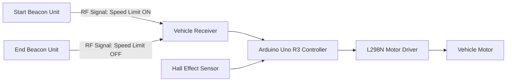
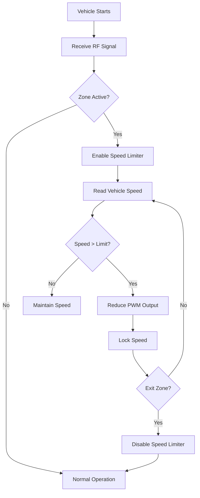

# Zone-Based Intelligent Vehicle Speed Limiter

## 1. Project Overview

### Description

The Zone-Based Intelligent Vehicle Speed Limiter is an embedded safety system designed to automatically regulate and enforce vehicle speed limits in sensitive areas such as schools, hospitals, residential zones, and construction sites.

The system uses wireless RF beacon transmitters installed at the entry and exit points of a restricted zone. When a vehicle enters the designated area, it receives the speed limit information wirelessly and automatically limits its speed to the prescribed value. The driver is prevented from exceeding the configured speed limit until the vehicle exits the restricted zone.

This project aims to improve road safety by reducing dependence on driver compliance and enabling automatic speed governance in high-risk areas.

### Target Users

* Educational Institutions
* Hospitals
* Residential Communities
* Industrial Campuses
* Smart City Infrastructure Providers
* Traffic Management Authorities

### Motivation

Despite the presence of speed limit signs, overspeeding remains a major cause of accidents near schools and hospitals. This project demonstrates how embedded systems and wireless communication can be used to actively enforce speed restrictions and improve public safety.

---

# 2. Technical Architecture

## System Block Diagram



---

## Operational Flowchart



---

# 3. Technologies Used

## Wireless Communication

* 433 MHz RF Communication
* Wireless Zone Detection

## Embedded Systems

* Arduino Uno R3
* Interrupt-Based Speed Monitoring
* PWM Motor Control

## Programming Languages

* C++
* Arduino Framework

## Development Tools

* Arduino IDE
* GitHub
* Fritzing (Circuit Design)
* Draw.io / Mermaid (Architecture Diagrams)

---

# 4. Hardware Components

## Core Hardware

| Component                        | Quantity |
| -------------------------------- | -------- |
| Arduino Uno R3                   | 1        |
| 433 MHz RF Transmitter (FS1000A) | 2        |
| 433 MHz RF Receiver Module       | 1        |
| Hall Effect Sensor (A3144)       | 1        |
| L298N Motor Driver               | 1        |
| DC Motor                         | 1        |
| Vehicle Chassis                  | 1        |
| Power Supply/Battery Pack        | 1        |

---

## External Hardware

| Component     | Purpose               |
| ------------- | --------------------- |
| Breadboard    | Circuit Prototyping   |
| Jumper Wires  | Connections           |
| Magnet        | Speed Detection       |
| USB Cable     | Programming Arduino   |
| Multimeter    | Testing and Debugging |
| Soldering Kit | Permanent Assembly    |

---

# 5. Software Components / Dependencies

## Development Environment

| Software    | Version          |
| ----------- | ---------------- |
| Arduino IDE | 2.x or later     |
| Git         | Latest           |
| GitHub      | Cloud Repository |

---

## Libraries

| Library                | Purpose               |
| ---------------------- | --------------------- |
| RadioHead              | RF Communication      |
| SPI                    | Communication Support |
| Arduino Core Libraries | GPIO, PWM, Interrupts |

---

# 6. Features

* Automatic speed limiting
* Wireless zone activation
* Wireless zone deactivation
* Real-time speed monitoring
* PWM-based motor control
* Driver-independent speed enforcement
* Low-cost implementation
* Scalable architecture

---

# 7. Future Enhancements

## GPS-Based Geofencing

Replace physical RF beacons with virtual GPS zones.

## IoT Connectivity

Transmit speed and zone information to cloud dashboards.

## Smart School Scheduling

Activate speed restrictions automatically during school hours.

## Emergency Vehicle Override

Allow emergency vehicles to bypass restrictions.

## Smart City Integration

Connect with traffic management systems for city-wide deployment.

## AI-Based Traffic Analytics

Analyze traffic patterns and speed violations.

---

# 8. Repository Structure

```text
Zone-Based-Intelligent-Vehicle-Speed-Limiter/
│
├── README.md
├── LICENSE
│
├── docs/
│   ├── Project_Report.pdf
│   ├── Circuit_Diagram.png
│   ├── Flowchart.png
│   └── Presentation.pptx
│
├── code/
│   ├── Start_Beacon/
│   ├── End_Beacon/
│   └── Vehicle_Unit/
│
├── images/
│   ├── hardware_setup.jpg
│   ├── prototype.jpg
│   └── testing.jpg
│
└── videos/
    └── demo_video.mp4
```

---

# Contributing

Contributions are welcome.

Please:

1. Fork the repository
2. Create a feature branch
3. Commit changes
4. Submit a pull request

---

# Code of Conduct

All contributors are expected to maintain a respectful and collaborative environment.

Please:

* Be respectful
* Provide constructive feedback
* Follow ethical open-source practices

---

# License

This project is licensed under the MIT License.

See the LICENSE file for details.

---

# 9. Maintainers / Contacts

| Name              | Role           | Contact Information              | GitHub Profile                           |
| ----------------- | -------------- | -------------------------------- | ---------------------------------------- |
| Nandini Agarwal   | Project Member | nandi.agrawal_ec23@gla.ac.in     | https://github.com/winsome-nandini       |
| Ayush Vishwakarma | Project Member | ayush.vishwakarma_ec23@gla.ac.in | https://github.com/Ayush-vishwakarma-git |
| Dr. Saurabh Singh | Faculty Mentor | saurab.singh@gla.ac.in           | N/A                                      |

---

# Acknowledgements

We sincerely thank our mentor for continuous guidance throughout the project.

We also acknowledge the valuable feedback and technical insights received from professionals at Silicon Labs during project discussions and evaluations.

Their suggestions helped shape the future scope and practical applicability of this work.
